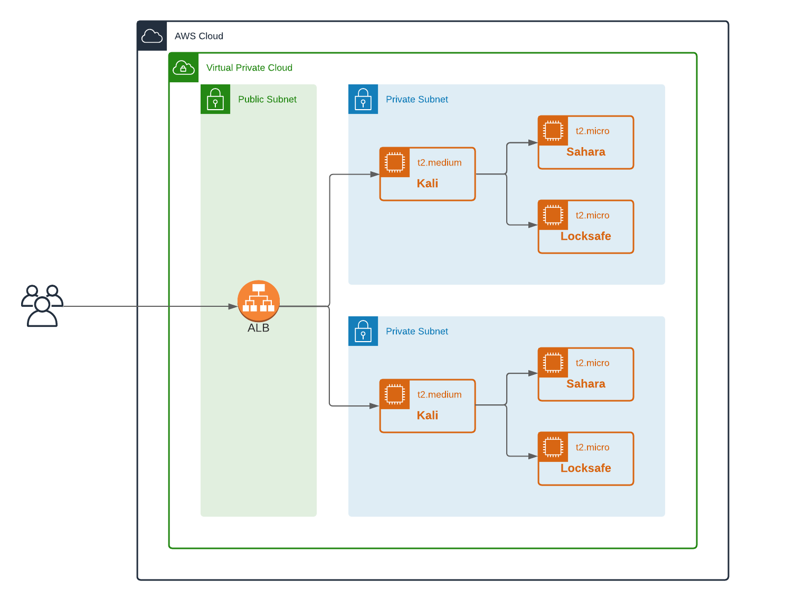

# Graduate CTF Environment

## Overview

This repo is to hold the code necessary to deploy an environment that is ready to go for students to get hands on experience with penetration testing. The terraform code deploys an isolated environment for each user so they can learn in a relatively risk-free playground.

## Build Steps

* In `services/packer/kali` run the command `packer build kali.json`
* In `services/packer/sahara` run the command `packer build sahara.json`
* Export the variable `TF_VARS_usernames` with the list of users that you want environments set up for
* In `services/terraform/deploy` run the command `terraform apply -auto-approve`

## Machines

### Kali

* Desktop environment - xfce4
* Remote desktop - Guacamole
* Useful applications stored under `/opt/useful` - Linpeas/Pspy/SecLists

### Sahara

* Debian host
* Vulnerable web application
* Poor permissions on scheduled job

### Locksafe

* Under development

## Architecture

